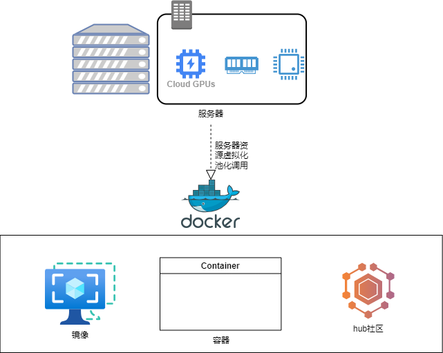

# 什么是docker

Docker 是一个开源的容器化平台，用于构建、打包和运行应用程序。它允许开发人员将应用程序及其依赖项打包到一个称为容器的独立单元中，以便在不同的环境中进行部署和运行。

与传统的虚拟化技术相比，Docker 使用容器化的方式更加轻量级和灵活。每个容器都包含应用程序、运行时环境和依赖项，它们之间相互隔离，但共享主机操作系统的内核。这使得容器可以在不同的操作系统和硬件平台上运行，而无需修改应用程序代码。

Docker 提供了一组工具和命令行接口，使开发人员可以方便地构建、管理和部署容器。以下是一些 Docker 的核心概念和组件：

1. 镜像（Image）：镜像是一个只读的模板，包含了运行应用程序所需的所有文件和配置。开发人员可以使用 Dockerfile 来定义镜像的构建过程，然后使用 Docker 构建工具将其生成。
2. 容器（Container）：容器是从镜像创建的运行实例。每个容器都是相互隔离的，具有自己的文件系统、进程空间和网络接口。容器可以启动、停止、删除和管理。
3. 仓库（Repository）：仓库是用于存储和共享镜像的地方。Docker Hub 是一个公共的仓库，你可以在其中找到许多常见的镜像。此外，你还可以创建私有仓库来存储自己的镜像。

